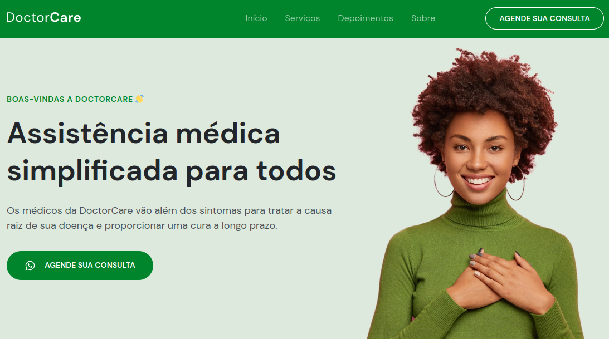

# NLW-Return
## Next Level Week Return - DOCTORCARE
Esté é um projeto feito para desenvolvermos uma aplicação completa do zero, na Next Level Week Return - online e gratuito de 02 a 06 de maio...

## 🚀 Tecnologias

Esse projeto foi desenvolvido com as seguintes tecnologias:

- HTML
- CSS
- JavaScript
- ScrollReveal
- <a href="https://code.visualstudio.com/"> Visual Studio Code </a>
- <a href="https://www.figma.com/"> Figma </a>

## 💻 Projeto
[🔗 Clique aqui para acessar](https://olgajuanne.github.io/NLW-Return/)
 
DoctorCare é uma página institucional no formato One Page, responsiva, para usar em diversos tipos de micros, pequenas e médias empresas. Contém as seguintes seções: Header, Navigation, Home, Sobre, Serviços e Footer

### 🎚 Modificações 
 
Depoimentos dos clientes

---

> *A NLW é um evento de conteúdos gratuitos voltados para programação, promovido pela **@Rocketseat**.*